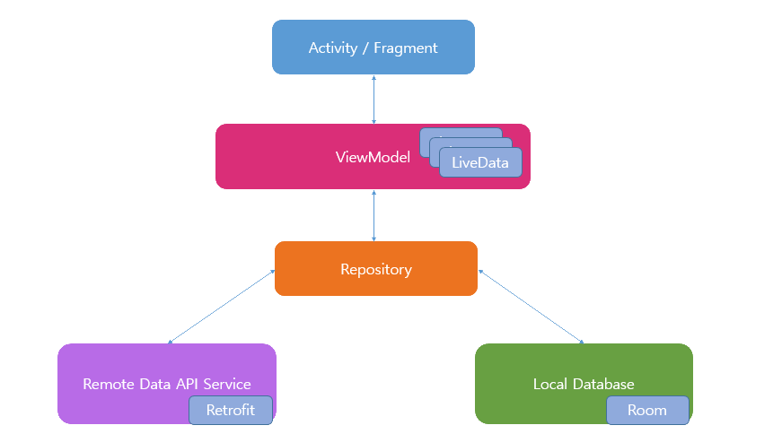

<h1 align="center">TDD-App</h1>

<p align="center">
This sample application helps you to understand how the Test-Driven development works with Android Architecture Component.</p>

<p align="center">
  <a href="https://opensource.org/licenses/Apache-2.0"></a>
  <a href="https://android-arsenal.com/api?level=21"></a>
</p>


## Tech stack & Open-source libraries
- Minimum SDK level 21
- [Kotlin](https://kotlinlang.org/) based + [Coroutines](https://github.com/Kotlin/kotlinx.coroutines) for asynchronous.
- [Koin](https://github.com/InsertKoinIO/koin) for dependency injection.
- JetPack
  - LiveData - notify domain layer data to views.
  - Lifecycle - dispose of observing data when lifecycle state changes.
  - ViewModel - UI related data holder, lifecycle aware.
- Architecture(https://developer.android.com/topic/libraries/architecture/index.html)
  - MVVM Architecture (View - DataBinding - ViewModel - Model)
- [Retrofit2 & OkHttp3](https://github.com/square/retrofit) - construct the REST APIs and paging network data.
- [Moshi](https://github.com/square/moshi) - A JSON serialization/deserialization library for Kotlin and Java.
- [Coil](https://coil-kt.github.io/coil/getting_started/) - A Image loading library.
- [Mockito](https://site.mockito.org/) - A Unit Testing framework.

## Architecture
The application is based on MVVM architecture and a repository pattern.



## Open API

TDD-App using the [The Movie DB API](https://developers.themoviedb.org/3/getting-started/introduction) for constructing restful API.<br>
The Movie DB API provides a restful API for movie and its related service.

Thanks for reading this repo. Be sure to click ★ below to recommend this repo if you found it helpful. It means a lot to me.

For more about programming, follow me on [Medium](https://medium.com/@yash786agg)

Also, Let’s become friends on [Linkedin](http://bit.ly/24t4EVI)

# License
```xml
Designed and developed by yash786agg (Yash Agarwal)

Licensed under the Apache License, Version 2.0 (the "License");
you may not use this file except in compliance with the License.
You may obtain a copy of the License at

   http://www.apache.org/licenses/LICENSE-2.0

Unless required by applicable law or agreed to in writing, software
distributed under the License is distributed on an "AS IS" BASIS,
WITHOUT WARRANTIES OR CONDITIONS OF ANY KIND, either express or implied.
See the License for the specific language governing permissions and
limitations under the License.
```
